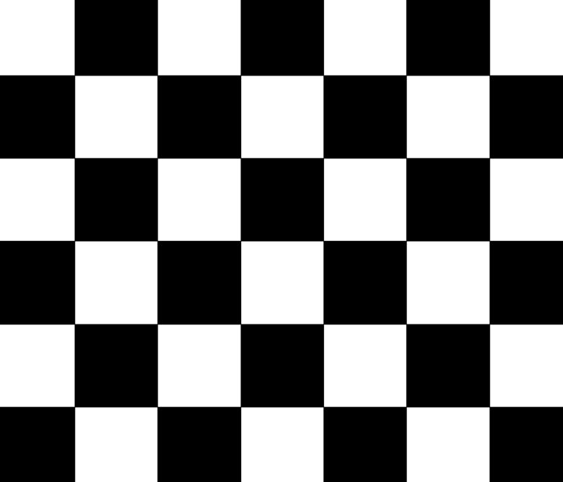

## My notes
<!-- activate -->
```sh
source my-env/bin/activate
cd computer_code
python3 api/index.py
```

```sh
cd computer_code
yarn run dev
```


### Script to allow access to camera without `sudo`
computer_code/cam_rules.sh

### ESP code
ArduinoJson
https://github.com/bblanchon/ArduinoJson
https://arduinojson.org/v7/how-to/install-arduinojson/


PID v1 install as zip
https://github.com/br3ttb/Arduino-PID-Library/tree/master?tab=readme-ov-file

sbus
https://github.com/bolderflight/sbus

## python things


instal it into python `venv`?
https://docs.python.org/3/tutorial/venv.html
```sh
python -m venv my-env
```
install dependences
```sh
sudo apt-get install python3-tk
pip install Pillow
pip install h5py
pip install flask
pip install flask-socketio
pip install serial # dk if that needed???
pip install ruckig
pip install flask_cors
pip install pyserial

pip install matplotlib
pip install pandas
```

### camera libs code, pseye, fixes
patched pseye https://github.com/Tintin-Axelsson/pseyepy/tree/master

https://github.com/Tintin-Axelsson/pseyepy/tree/master

### openCV
can be useful?
https://github.com/alyssaq/reconstruction

https://stackoverflow.com/a/45582705

!!!!

? https://docs.opencv.org/4.x/d2/de6/tutorial_py_setup_in_ubuntu.html

? https://gist.github.com/alvaro893/6125aa58f8a1bb3895f75684af0ea24d

full guide (but without tunes)
https://bksp.space/blog/en/2020-03-01-compiling-opencv-with-structure-from-motion-module-python-bindings.html

#### this is the way
```sh
source /path/to/your/venv/bin/activate
```

```sh
git clone <opencv>
git clone <opencv_contrib>
cd <opencv folder>
mkdir buid
cd build
```
```sh
cmake .. \
    -DCMAKE_BUILD_TYPE=Release \
    -DCMAKE_INSTALL_PREFIX=/home/anatolii/projects/Low-Cost-Mocap/my-env \
    -DOPENCV_EXTRA_MODULES_PATH=../../opencv_contrib/modules \
    -DBUILD_opencv_sfm=ON \
    -DBUILD_opencv_python_bindings_generator=ON \
    -DPYTHON_EXECUTABLE=/home/anatolii/projects/Low-Cost-Mocap/my-env/bin/python \
    -DPYTHON_INCLUDE_DIR=/home/anatolii/projects/Low-Cost-Mocap/my-env/include/python3.10 \
    -DPYTHON_LIBRARY=/home/anatolii/projects/Low-Cost-Mocap/my-env/lib/libpython3.10.so \
    -DINSTALL_PYTHON_EXAMPLES=ON \
    -DBUILD_TESTS=OFF \
    -DBUILD_EXAMPLES=OFF

```
```
make -j8
```
```sh
sudo make install
```

### Other things

some mocap system
https://docs.ipisoft.com/User_Guide_for_Multiple_PS_Eye_Cameras_Configuration

### Camera, lens

MINI-2,8 M12 F=2,8 мм, угол обзора 81x65°, F 2,0 1/3" Подробнее: https://tehbezpeka.ua/p108997168-obektiv-dlya-kamer.html
Фиксированный 3-х мегапиксельный объектив для охранных камер видеонаблюдения f=2,8 мм, угол обзора 135 ° (мод. LS-2.8M) – 1 шт. Подробнее: https://tehbezpeka.ua/p108997168-obektiv-dlya-kamer.html

https://wavelength-oe.com/uk/optical-calculators/field-of-view/
Focal Length (mm)*
2.8
Pixel Size (μm)*
12 (not sure, 6um when resolution twice(forth) bigger?)
Detector Horizontal Pixels*
320
Detector Vertical Pixels*
240
Horizontal FOV (°)
68.9
Vertical FOV (°)
54.4
Diagonal FOV (°)
81.2
Image Size (mm)
4.8

other calc https://www.scantips.com/lights/fieldofview.html#top

epipolar geometry
https://www.youtube.com/watch?v=cLeF-KNHgwU&list=PLgnQpQtFTOGQh_J16IMwDlji18SWQ2PZ6&index=36

ps3 eye camera
https://www.playstation.com/content/dam/global_pdc/en/corporate/support/manuals/accessories/ps3-accessories/sceh-00448-ps-eye/SCEH-00448_PS%20Eye_IM%24en.pdf
320x240

intrinsic-matrix
https://stackoverflow.com/questions/78072261/how-to-find-cameras-intrinsic-matrix-from-focal-length

https://stackoverflow.com/questions/25874196/camera-calibration-intrinsic-matrix-what-do-the-values-represent


https://www.reddit.com/r/astrophotography/comments/k0bieg/the_moon_2411_with_a_ps3_eye_camera_8_dobsonian/
 Since it had a 6 um pixelsize, based on a chart I saw and my focal length of 1200

https://astrobeano.blogspot.com/2013/03/ps3-eye-camera-for-astrophotography.html 
http://image-sensors-world.blogspot.com/2010/10/omnivision-vga-sensor-inside-sony-eye.html

https://html.alldatasheet.com/html-pdf/312422/OMNIVISION/OV7725/599/1/OV7725.html

some mocap software
https://docs.ipisoft.com/User_Guide_for_Multiple_PS_Eye_Cameras_Configuration


### Camera calibration

#### info
https://www.youtube.com/watch?v=GUbWsXU1mac


https://www.youtube.com/watch?v=O-7TkOKeK2M

https://github.com/tizianofiorenzani/how_do_drones_work/blob/master/opencv/ChessBoard_9x6.jpg


guy explains how to calibrate camera and where to get matrix and distortion coefs
https://youtu.be/EWqqseIjVqM?si=Wy8BY6NYLw00Lx1P&t=241

camera calibration
https://github.com/jyjblrd/Low-Cost-Mocap/discussions/23#discussioncomment-8118097

#### Camera calibration scripts 
based on

https://docs.opencv.org/4.x/dc/dbb/tutorial_py_calibration.html

https://learnopencv.com/camera-calibration-using-opencv/

use next chessboard image


create folders
```sh
cd computer_code
mkdir cam_1
mkdir cam_1_c
```

run from `Low-Cost-Mocap/computer_code/` to get images from pseye camera
```sh
api/camera_pseyepy_collect_images.py
```

run to calc camera params from collected images 
```sh
api/camera_calc_params.py
```
remove bad recognized images from `cam_1` if you got such and run it again!!!


```js
// my 3 cams
// self.cameras = Camera(fps=90, ids=[2, 1, 0], resolution=Camera.RES_SMALL, gain=10, exposure=100)
[{"R":[[1,0,0],[0,1,0],[0,0,1]],"t":[0,0,0]},{"R":[[0.1722637774422725,0.7827356242616863,-0.5980385719106981],[-0.7672480350097106,0.48737412426679616,0.4168895726315438],[0.6177828451446811,0.3870289466006923,0.6845092773206958]],"t":[0.7170268722889785,-0.46208281725881506,0.35540442147238177]},{"R":[[-0.9822094024646937,-0.13421744172852396,0.13134065648457616],[0.160581676447473,-0.2377053740843171,0.9579716490172107],[-0.09735612409739951,0.9620196637633168,0.25502931524326106]],"t":[-0.20578254670461457,-1.0456168396141954,0.8016965557594956]}]


[[0.9941338485260931,0.0986512964608827,-0.04433748889242502,0.9938296704767513],[-0.0986512964608827,0.659022672138982,-0.7456252673517598,2.593331619023365],[0.04433748889242498,-0.7456252673517594,-0.6648888236128887,2.9576262456228286],[0,0,0,1]]

// with origin
[{"R":[[1,0,0],[0,1,0],[0,0,1]],"t":[0,0,0]},{"R":[[0.1722637774422725,0.7827356242616863,-0.5980385719106981],[-0.7672480350097106,0.48737412426679616,0.4168895726315438],[0.6177828451446811,0.3870289466006923,0.6845092773206958]],"t":[0.7170268722889785,-0.46208281725881506,0.35540442147238177]},{"R":[[-0.9822094024646937,-0.13421744172852396,0.13134065648457616],[0.160581676447473,-0.2377053740843171,0.9579716490172107],[-0.09735612409739951,0.9620196637633168,0.25502931524326106]],"t":[-0.20578254670461457,-1.0456168396141954,0.8016965557594956]}]

[[0.9941338485260931,0.0986512964608827,-0.04433748889242502,-0.0983113022924278],[-0.0986512964608827,0.659022672138982,-0.7456252673517598,1.2642083707956262],[0.04433748889242498,-0.7456252673517594,-0.6648888236128887,0.5346970677406504],[0,0,0,1]]

```


# Low Cost Mocap (for drones)

### A general purpose motion capture system built from the ground up, used to autonomously fly multiple drones indoors

## Dependencies
Install the pseyepy python library: [https://github.com/bensondaled/pseyepy](https://github.com/bensondaled/pseyepy)

This project requires the sfm (structure from motion) OpenCV module, which requires you to compile OpenCV from source. This is a bit of a pain, but these links should help you get started: [SFM dependencies](https://docs.opencv.org/4.x/db/db8/tutorial_sfm_installation.html) [OpenCV module installation guide](https://github.com/opencv/opencv_contrib/blob/master/README.md)

`cv.sfm` is only used 3 times in the codebase for the following functions: `fundamentalFromProjections`, `essentialFromFundamental`, `motionFromEssential`. So really, those functions should just be reimplemented in Python so the sfm module isn't needed. [Issue](https://github.com/jyjblrd/Mocap-Drones/issues/4).

install npm and yarn

## Runing the code

From the computer_code directory Run `yarn install` to install node dependencies 

Then run `yarn run dev` to start the webserver. You will be given a url view the frontend interface.

In another terminal window, run `python3 api/index.py` to start the backend server. This is what receives the camera streams and does motion capture computations.

## Documentation
The documentation for this project is admittedly pretty lacking, if anyone would like to put type definitions in the Python code that would be amazing and probably go a long way to helping the readability of the code. Feel free to also use the [discussion](https://github.com/jyjblrd/Mocap-Drones/discussions) tab to ask questions.

My blog post has some more information about the drones & camera: [joshuabird.com/blog/post/mocap-drones](https://joshuabird.com/blog/post/mocap-drones)

## YouTube Video
Watch this for information about the project & a demo!
[https://youtu.be/0ql20JKrscQ?si=jkxyOe-iCG7fa5th](https://youtu.be/0ql20JKrscQ?si=jkxyOe-iCG7fa5th)


## Architectural Diagram


DRONE XYZ: -0.421  0.154  0.296 heading:-0.141559525860047

відтестити спочатку ось z а потім вже інші

# PID
- insite of corrections https://support.haltech.com/portal/en/kb/articles/pid 

- to read
https://www.motor.com/magazine-summary/lean-codes-january-2018/

https://blog.isa.org/avoid-common-tuning-mistakes-pid
